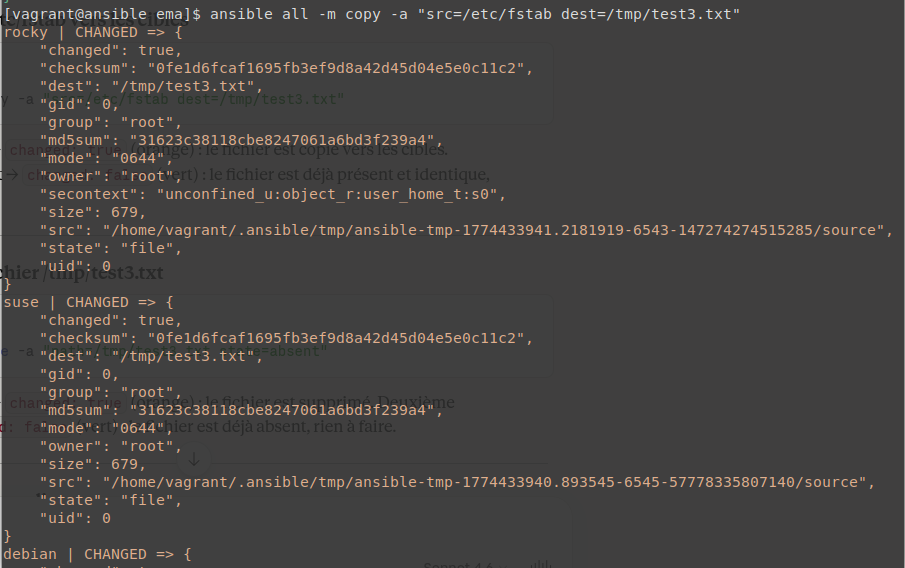
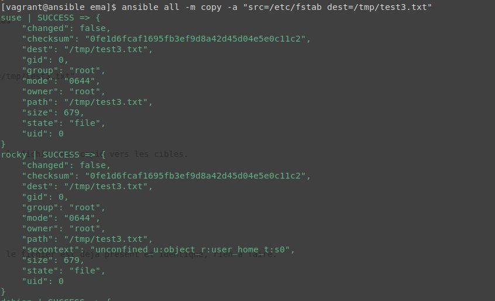
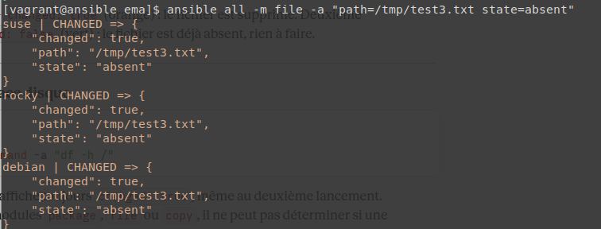
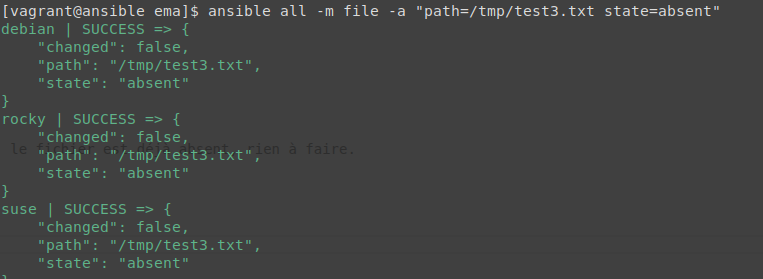
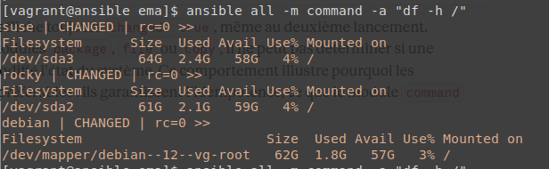
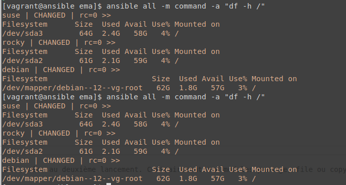

## Installation des paquets

<br>

```
ansible all -m package -a "name=tree state=present"
ansible all -m package -a "name=git state=present"
ansible all -m package -a "name=nmap state=present"
```

Premier lancement → changed: true (orange) : les paquets sont installés.

<br>


<br>

Deuxième lancement → changed: false (vert) : les paquets sont déjà présents, rien à faire.

<br>


## Désinstallation des paquets 


```
ansible all -m package -a "name=tree state=absent"
ansible all -m package -a "name=git state=absent"
ansible all -m package -a "name=nmap state=absent"
```


Premier lancement → changed: true (orange) : les paquets sont supprimés.

<br>


<br>

Deuxième lancement → changed: false (vert) : les paquets sont déjà absents, rien à faire.


<br>


<br>


## Copie du fichier /etc/fstab vers les cibles


```

ansible all -m copy -a "src=/etc/fstab dest=/tmp/test3.txt"

```

<br>


Premier lancement → changed: true (orange) : le fichier est copié vers les cibles.

<br>




<br>

Deuxième lancement → changed: false (vert) : le fichier est déjà présent et identique, rien à faire.


<br>



<br>


## Suppression du fichier /tmp/test3.txt


<br>

```
ansible all -m file -a "path=/tmp/test3.txt state=absent"

```

<br>

Premier lancement → changed: true (orange) : le fichier est supprimé.

<br>




<br>

Deuxième lancement → changed: false (vert) : le fichier est déjà absent, rien à faire.

<br>





<br>

## Affichage de l'espace disque


```

ansible all -m command -a "df -h /"

```

<br>



<br>




Le module command affiche toujours changed: true, même au deuxième lancement. Contrairement aux modules package, file ou copy, il ne peut pas déterminer si une commande brute a modifié l'état du système. 
Ce comportement montre très bien pourquoi les modules dédiés sont préférables : ils garantissent l'idempotence, ce que le module command ne fait pas.

